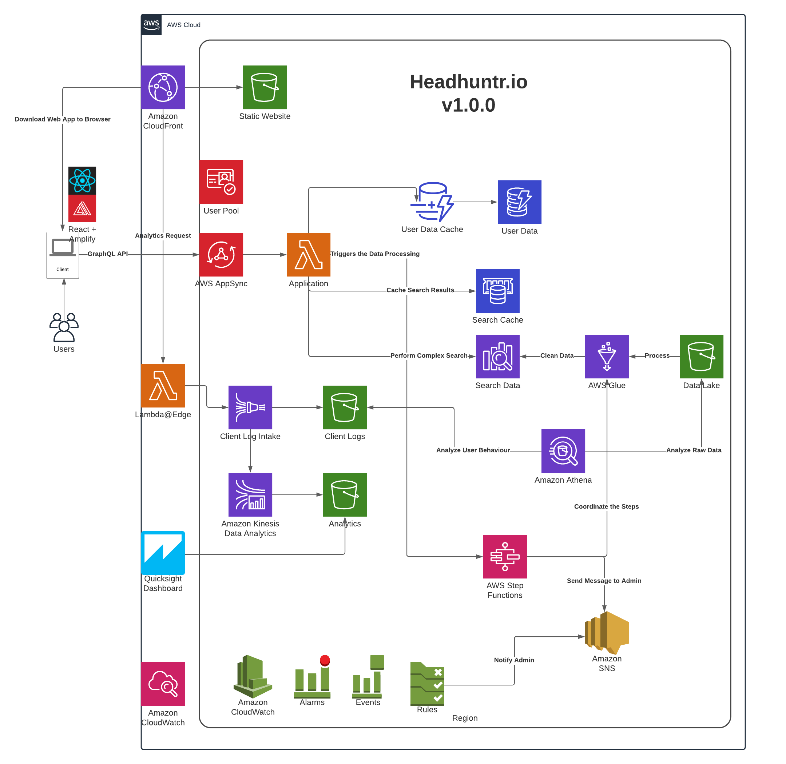

# Headhuntr.io
This project will be mainly for demonstrating my skills in the following area:
- AWS Certified Solutions Architect Professional
- AWS Certified Developer Associate
- AWS Certified Data Analytics Specialty
- AWS Certified Machine Learning Specialty
- Tensorflow Certified Developer

## Phase 1: Application
This basically covers the AWS Developer certification
- establish a IaC setup using CDK
- simple React + Amplify app with a basic Cognito registration+authentication
- setup a BE using SAM and expose it using AppSync
- setup a build pipeline for the FE+BE using Code Pipeline
- persistence with DynamoDB
- search with ES
- monitoring with Cloudwatch and Xray

## Phase 2: Data Processing and Analytics
This is where we practice for the AWS Data Analytics specialty
- intake for client logs using Kinesis Firehose via Lambda@Edge
- use Glue and Athena to analyze our candidates data
- use Glue to populate the search database
- job coordination via Step Function
- app dashboard using Quicksight

## Phase 3: Machine Learning
This is the icing of the cake where we obviously would get the Certified Machine Learning Specialization certificate and Tensorflow
- use NLP to tag our source data
